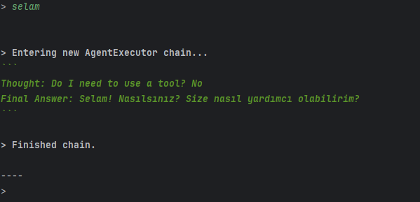

# Simple-AI-Agent
An intelligent conversational agent powered by OpenAI's GPT-4o-mini and LangChain, with real-time memory and internet search capabilities.

Features
💬 Conversational Memory: Keeps track of previous interactions using an in-memory SQLite database.

🌐 Internet Search: Automatically searches for information via TavilySearch when needed.

⚡ Streaming Responses: Answers are streamed chunk-by-chunk for faster user experience.

🧠 Reasoning + Acting (ReAct): Combines thinking and action execution using LangChain's ReAct agent framework.

🛠️ Easily Extendable: Add new tools, models, or memory modules.

Technologies Used
Python 3.10+

LangChain

OpenAI GPT-4o-mini

Tavily Search

SQLite Memory Saver

